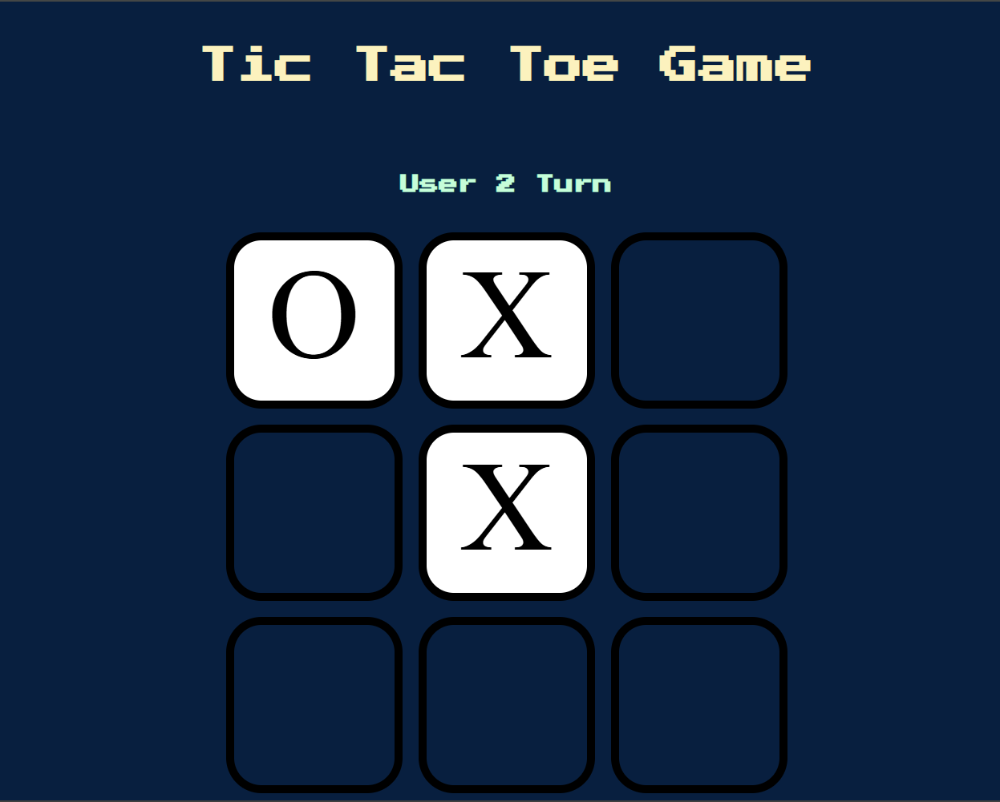
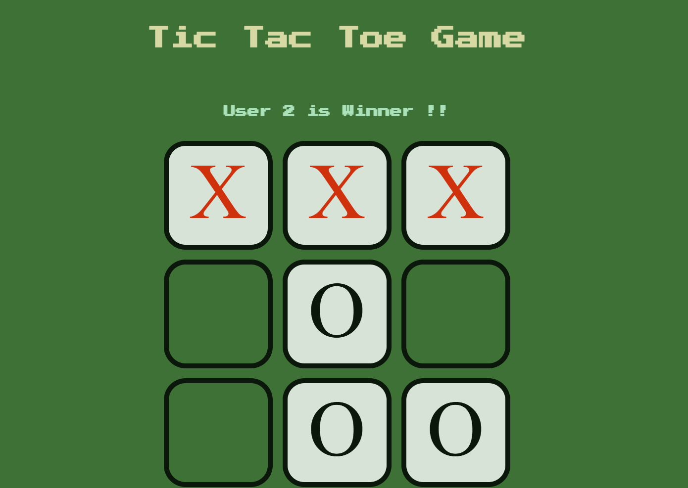
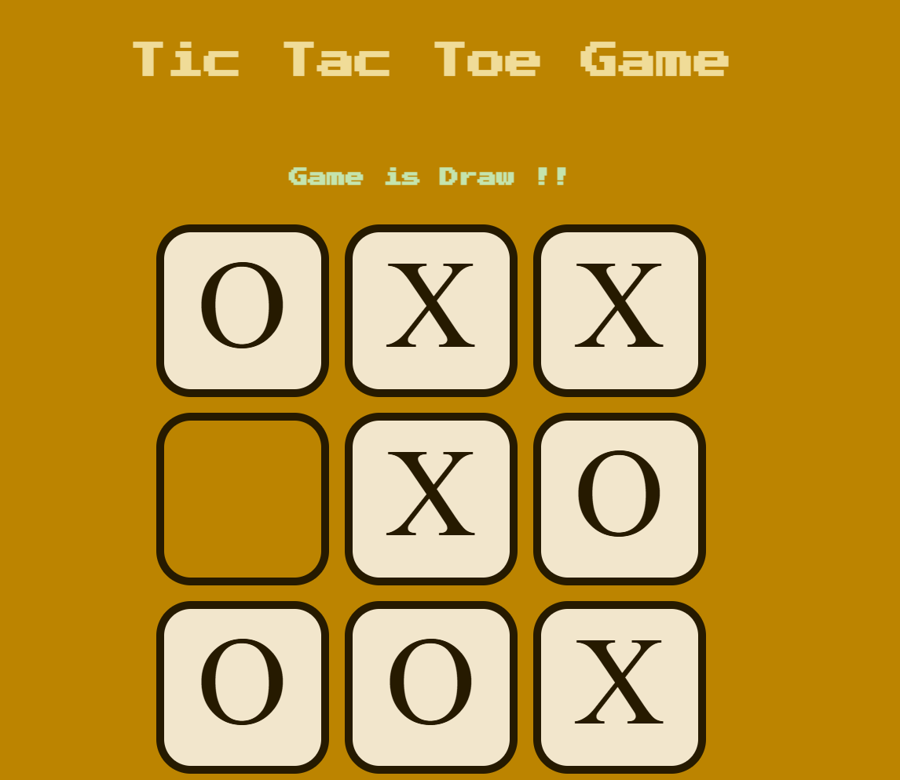

# <h1 align="center">Tic Tac Toe</h1>
A classic two-player Tic Tac Toe game, reimagined for the web, offering interactive and dynamic gameplay.


---

## Project Description

Tic Tac Toe Digital Duo brings the timeless Tic Tac Toe game to your browser. Designed for quick and engaging matches between two players, this project emphasizes simplicity, fun, and accessibility. Whether you're looking to relive childhood memories or challenge a friend, this web-based Tic Tac Toe game offers an easy-to-use, visually appealing interface.

---

## Table of Contents

- [Project Title and Overview](#tic-tac-toe--digital-duo)
- [Project Description](#project-description)
- [Features](#features)
- [Technology Stack](#technology-stack)
- [Demo and Preview](#demo-and-preview)
- [Installation](#installation)
- [Usage](#usage)
- [Configuration](#configuration)
- [Testing](#testing)
- [License](#license)
- [FAQs](#faqs)
- [Contact Information](#contact-information)

---

## Features

- **Two-Player Gameplay**: Designed for two players to enjoy on a single device.
- **Dynamic Updates**: Real-time updates to the game board after each move.
- **Responsive Design**: Optimized for seamless gameplay on desktops, tablets, and smartphones.
- **Interactive Feedback**: Highlights the winner or announces a tie at the end of each game.
- **User-Friendly Interface**: Intuitive and visually appealing layout.

---

## Technology Stack

- **Frontend**: HTML5, CSS3, JavaScript
- **Libraries**: None
- **Tools**: VS Code

---

## Demo and Preview





---

## Installation

1. Clone the repository:
   ```bash
   git clone https://github.com/ThakkarVidhi/classic-tic-tac-toe.git
   ```
2. Navigate to the project folder:
    ```bash
    cd clasic-tic-tac-toe
    ```
3. Open `index.html` in your browser.

---

## Usage
- Two players take turns clicking on empty cells to place their marks (X or O).
- The game announces the winner or a tie once all moves are made.
- Refresh the page to start a new game.

---

## Configuration
There are no special configuration settings for this project.

---

## Testing
This project does not include automated tests. To test the application:
1. Open it in your browser.
2. Play a few rounds to ensure the game logic and UI behave as expected.

---

## License
This project is licensed under the MIT License.

---

## FAQs

### Can I play against a computer?
Currently, the game supports two-player mode only.

---

# Contact Information
For inquiries, reach out to me at [vidhithakkar.ca@gmail.com](mailto:vidhithakkar.ca@gmail.com) or connect via [LinkedIn](https://www.linkedin.com).